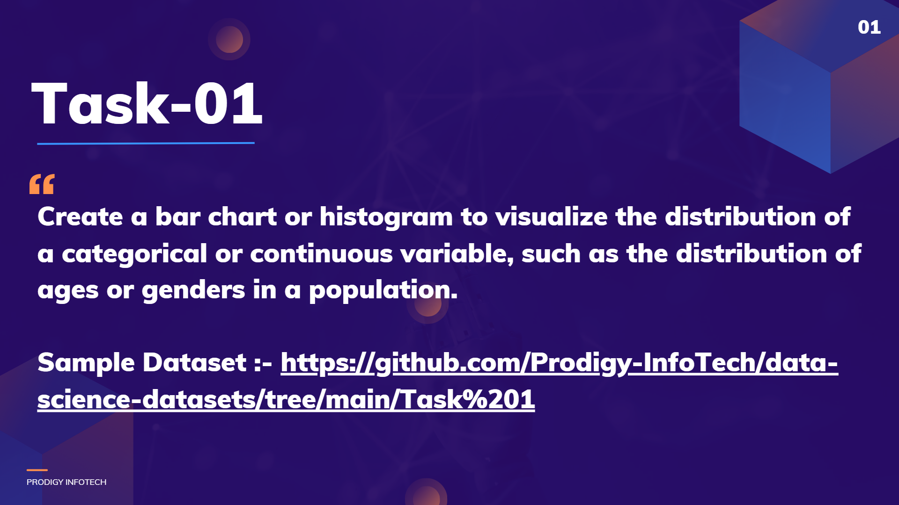

# 🚀 PRODIGY_DS_01 – Data Science Internship (Task 1)

**📌 Internship:** Prodigy Infotech – *Data Science*  
**📅 Task:** Exploratory Data Analysis (EDA) on World Population Dataset (2022)  
**👨‍💻 Author:** [Rithik CA](https://www.linkedin.com/in/rithik-ca-a39b02292)

---

## 📖 Overview

This repository contains my **Task 1 submission** for the **Prodigy Infotech Data Science Internship**.  
The task focuses on performing **Exploratory Data Analysis (EDA)** to extract insights from the **World Population Dataset (2022)** using Python and visualization tools.

---

## 🛠️ Tech Stack & Libraries

- **Python** – Core programming language
  
- **Jupyter Notebook** – Development environment
  
- **Pandas** – Data cleaning, manipulation, and analysis
  
- **NumPy** – Numerical computations
  
- **Matplotlib** – Data visualization
  
- **Seaborn** – Statistical and advanced visualizations
  

---

## 🌍 Dataset Details

The dataset includes **country-wise population statistics** and demographic features for 2022.  
**Key columns include:**

- 🌐 Total Population
  
- 📈 Yearly Population Change (%)
  
- 🧮 Population Density
  
- 👶 Fertility Rate
  
- 🎂 Median Age
  
- 🏙️ Urban Population Share (%)
  
- 🌏 World Population Share (%)
  
- ➕ Migration Data
  

---

## 📊 Project Workflow

### **1️⃣ Data Understanding**

- Checked dataset structure, column types, and basic statistics
  
- Identified missing or inconsistent data
  

### **2️⃣ Data Cleaning**

- Handled null values
  
- Fixed data type mismatches
  
- Removed inconsistencies and prepared data for analysis
  

### **3️⃣ Visualization & Insights**

- **Bar Charts** – Top 10 most populous countries
  
- **Heatmap** – Correlation between fertility, median age, and migration
  
- **Histograms & Boxplots** – Distribution and outlier detection
  
- **Stacked Bar Charts** – Urban vs total population
  

---

## 💡 Key Insights

- 🌏 **Population Concentration:** A few countries hold the majority of the world’s population
  
- 👶 **Fertility vs Median Age:** Higher fertility → younger population
  
- 🏙️ **Urbanization Trends:** Urbanized nations have higher density
  
- 📌 **Outliers:** Large variations in migration and fertility rates between countries
  

---

## 🎯 Conclusion

This task strengthened my skills in:

- **Data Cleaning & Preprocessing**
  
- **Statistical Analysis**
  
- **Data Visualization & Storytelling**
  

EDA is an essential step before diving into advanced data modeling — it reveals patterns, relationships, and anomalies that shape further analysis.

---

## 🔗 Connect with Me

- **LinkedIn:** [Rithik CA](https://www.linkedin.com/in/rithik-ca-a39b02292)
  
- **Portfolio:** *(Coming Soon)*
  

---

If you like this project, consider ⭐ **starring** the repository!
